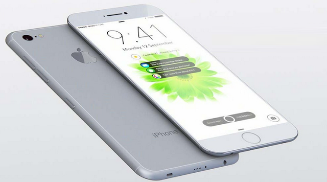

<h2>hover + animate </h2>

<h3>Instrução </h3>

<p>Prepare o sistema de Grid que vai receber o codigo do Hover animate.</p>
<br>
<p>O arquivo atual utiliza o sistema de grid do Bootstrap para tornar o site responsivo.</p>
<br>
http://getbootstrap.com/getting-started/#download


<p>HTML com Bootstrap</p>


```html
	<div class="container">
		<div class="row">
			<div class="col-md-12">
				<div class="col-md-6">
					
				</div>
				
			</div>
		</div>
	</div>

```

<p>Coloque o codigo abaixo dentro do teu sistema de Grid.</p>

<p>HTML do hover animate </p>

1
```html
<figure class="img-hover-1 animate">

	
	<h2 class="title-1 out-title-1 in-title-1 ani-2s">iPhone 7</h2>

	<div class="div-info-1">
		<h2 class="value-1 out-value-1 in-value-1 ani-2s"> <span> Por: </span> R$ 2.990</h2>
		<h3 class="value-1 out-value-1 in-value-1 ani-2s"> <span> De: </span> R$ 3.590</h3>
	</div>

	<button class="bt-1 out-bt-1 in-bt-1 ani-3s"><a href=""> Confira </a></button>

</figure>
```

<br>

2
```html
<figure class="img-hover-3 animate">

	
	 <h2 class="title-3 out-title-3 in-title-3 ani-2s">PERFUMES</h2>

	<div class="div-info-3 out-info-3 in-info-3 ani-1s">
		<h2 class="value-3 out-value-3 in-value-3 ani-2s"> <span> Até </span> -50%</h2>
	</div>

	<button class="bt-3 out-bt-3 in-bt-3 ani-2s"><a href=""> Confira </a></button>
						
</figure>
```
<p>Observe que no segundo exemplo não é utilisado a Tag h3 para uma nova informação, se atente nisso na hora da escolha.</p>

<br>
<p>Cada hover animate possui um valor em sua Class que é separado por um traço e virgula ( -1 ) esse número se refere à animação daquele hover. </p>
<br>
<p>Veja no link abaixo que cada imagem tem um número de referência.</p>
<br>
https://diegomoralesnavarro.github.io/-hover-animate.github.io/
<br>

<p>A class ani-2s é uma exceção, este numero se refere á velocidade de ação de 1 até 3 segundos.</p>

<br>


<h3>Configuração avançada CSS. </h3>
<br>
<br>

<h3>Dentro da pasta CSS / estilo.css  </h3>
<br>
<br>

<p>Está dividido por partes, seguindo a mesma regra separado por um traço e virgula ( -1 ).</p>
<br>

<p>.img-hover-?  está se referindo a tag principal que vai guardar a imagem e texto.
Obs: "position: relative; "</p>
<br>

<p>.title-? esta se referindo ao título da imagem que pode ser fixo ou não de acordo com a animação escolhida.
Obs: "position: absolute; " para ficar sobre a imagem e " top: 10%; left: 65%; " são as coordenadas para ajustar na tela.</p>
<br>

<p>.div-info-? comporta o conteudo informativo.
Obs: Também utiliza "position: absolute; " para ficar sobre a imagem e " top: 10%; left: 65%; " são as coordenadas para ajustar na tela.</p>
<br>

<p>.bt-? o botão que também utiliza a mesma forma de configurar como o div-info-?.</p>
<br>

<p>.animate é a forma de chamar a animação, essa class sempre é seguida de outra class que vai definir se é entrada "in" ou saida "out".</p>
<br>

<p>Atenção: esse script estilo.css pode ser editado, no entanto cuidado no momento de ajustar as coordenadas dos elementos.</p>
<br>
<br>

<h3>Dentro da pasta CSS / animar.css </h3>
<br>

<p>Estão todas as animações, e não tem a necessidade se ser editado.</p>

<br>
<br>
<h3>Imagem dimenção recomendada. </h3>
<br>
<p>Largura: 640  Altura: 360 px.</p>

<br>


